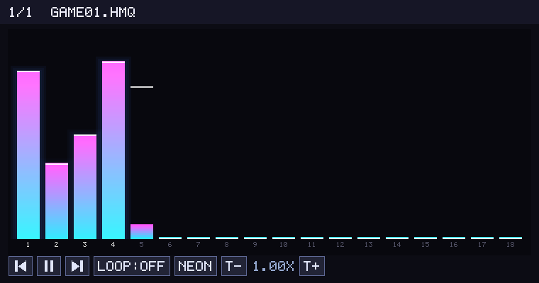

# Descent HMP Player

A command-line player for the original `.hmp` music files from **Descent 1 & 2**, built
to send audio directly to real MIDI and OPL3 hardware. No emulation, no software
synthesis — just the game's music on the devices it was designed for.

Aimed at two targets:

- **RetroWave OPL3 Express** — direct USB serial playback on real OPL3 hardware, with
  the **correct instrument bank chosen automatically per song** (Descent uses four
  different FM banks across its soundtrack), exactly as it sounded on a real Sound Blaster
- **General MIDI modules** (Roland SC-55, or an MT-32pi in GM/soundfont mode) — the
  `.hmp` files played to any ALSA MIDI port

> **Why not native MT-32?** Descent's `.hmp` files carry the dense OPL arrangement
> (13–16 MIDI channels) with no separate MT-32 track set. A real MT-32 has only 9 parts,
> so it physically can't voice the whole arrangement — native MT-32 mode was dropped.
> GM mode plays every channel and is the supported MIDI path.

Also includes **`hogtool`**, a simple extractor for Descent's `.hog` archive format,
needed to pull the music and instrument banks out of the game files.

---

## Tools

| Tool | What it does |
|---|---|
| `hmpplay` | Plays `.hmp` files to any ALSA MIDI port (General MIDI: SC-55, MT-32pi GM mode, …) |
| `hmpplay_opl3` | Plays `.hmp` files directly to a RetroWave OPL3 Express via USB serial, with automatic per-song instrument banks |
| `hogtool` | Lists, extracts, and creates Descent `.hog` archives |

---

## Tested hardware

| Device | Tool | Notes |
|---|---|---|
| RetroWave OPL3 Express | `hmpplay_opl3` | Direct OPL3 FM synthesis via libADLMIDI, auto-selecting each song's authored Descent bank (Int / Ham / Rick / Asterix) |
| Roland SC-55 / MT-32pi (GM mode) | `hmpplay` | General MIDI playback — voices all 13–16 channels of the arrangement |
| RetroWave OPL3 Express | `hmpplay` + [RetroWave MIDI Proxy](https://github.com/SudoMaker/RetroWaveMIDIProxy) | OPL3 via ALSA MIDI — simpler setup but uses proxy's own sound banks |

---

## Dependencies

```bash
sudo apt install libasound2-dev   # hmpplay only
sudo apt install cmake             # hmpplay_opl3 (builds libADLMIDI)
sudo apt install libsdl2-dev       # OPTIONAL — only for hmpplay_opl3 --gui
# hogtool needs nothing beyond libc
```

The terminal `hmpplay_opl3` needs only **cmake + a C++ compiler** (and git for the
submodule) — no extra dependencies, no display required. SDL2 is **optional**:
`build.sh` detects it automatically and compiles the `--gui` visualizer in only if
it's present. Without SDL2 you get a full terminal-only player, and `--gui` simply
prints a note and plays in the terminal.

`hmpplay_opl3` depends on **libADLMIDI**, included as a git submodule. Clone with:

```bash
git clone --recurse-submodules <this-repo>
# already cloned without it? grab it (or just run ./build.sh, which does this):
git submodule update --init
```

`./build.sh` initialises the submodule if needed, patches it for the RetroWave's 2 Mbaud
serial rate, builds it, then compiles the player. `./build.sh fast` rebuilds just the
player after editing it.

---

## Quick start

### 1. Extract the game files

The music, instrument banks, and the `descent.sng` song list are all packed inside the
game's `.hog` archive. Extract everything into one folder so `hmpplay_opl3` can find the
per-song bank list:

```bash
# Build hogtool
gcc -O2 -o hogtool hogtool.c

# Extract everything (songs + .bnk banks + descent.sng) into ./music/
./hogtool extract descent.hog -o ./music/
```

### 2. Play

```bash
# General MIDI module (SC-55, or MT-32pi in GM mode)
g++ -std=c++17 -O2 -o hmpplay hmpplay.cpp -lasound
./hmpplay -p 20:0 ./music/

# RetroWave OPL3 Express (direct) — bank auto-selected per song from descent.sng
./build.sh
./hmpplay_opl3 ./music/
```

---

## hmpplay

Reads `.hmp` files and sends MIDI events to any ALSA sequencer port — for a **General
MIDI** module such as a Roland SC-55 or an MT-32pi in GM/soundfont mode. It plays all
music tracks, so the GM device voices the full arrangement.

### Build

```bash
g++ -std=c++17 -O2 -o hmpplay hmpplay.cpp -lasound
```

### Usage

```bash
./hmpplay [options] <file.hmp | directory> [...]
```

```bash
# List available ALSA MIDI output ports
./hmpplay --list

# Play a directory of HMP files
./hmpplay -p 128:0 ./music/

# Loop indefinitely
./hmpplay -l -p 128:0 ./music/

# Play a directory then a specific extra file
./hmpplay -p 128:0 ./music/ credits.hmp
```

### Options

| Option | Description |
|---|---|
| `-p client:port` | ALSA destination port (e.g. `128:0`). Prompts if omitted. |
| `-l` | Loop the playlist indefinitely. |
| `-t scale` | Tempo multiplier. `0.5` = half speed, `2.0` = double. Default: `1.0`. |
| `-v` | Verbose — print every MIDI event. |
| `--list` | List available ALSA MIDI output ports and exit. |

### Keyboard controls

| Key | Action |
|---|---|
| `n` or `Space` | Next song |
| `p` | Previous song |
| `l` | Toggle loop on / off |
| `+` / `=` | Tempo +25% (max 4×) |
| `-` | Tempo −25% (min 0.25×) |
| `q` or Ctrl-C | Quit |

### Finding your ALSA port

```bash
./hmpplay --list
# or
aplaymidi -l
```

```
Available ALSA MIDI output ports:
  Port   Client Name                    Port Name
  ------  ------------------------------ ----------
  14:0   Midi Through                   Midi Through Port-0
  20:0   USB MIDI Interface             USB MIDI Interface MIDI 1
  128:0  RetroWave MIDI Proxy           RetroWave OPL3
```

### Playing to a GM module (SC-55 / MT-32pi GM mode)

Put your module in GM mode, connect it (e.g. a USB MIDI interface), find its ALSA port,
then:

```bash
./hmpplay -p 20:0 ./music/
```

That's it — `hmpplay` sends all of the song's tracks, and the GM device provides the
sounds. There is no device flag to set.

#### Why no native MT-32 mode?

Descent's music was composed with the MT-32 in mind, but the `.hmp` files we extract carry
the **dense OPL arrangement** — 13–16 MIDI channels — and contain no separate MT-32 track
set (the per-device track map referenced by older tools isn't actually populated in these
files). A real MT-32 has only **9 parts**, so it physically cannot voice a 13-channel
arrangement: switch a real MT-32 (or MT-32pi in MT-32 mode) on and you simply lose the
extra voices. GM mode has all 16 channels and plays everything, so that's the supported
MIDI path. (For the authentic FM sound, use `hmpplay_opl3` on OPL3 hardware.)

### RetroWave OPL3 Express via MIDI Proxy

The [RetroWave MIDI Proxy](https://github.com/SudoMaker/RetroWaveMIDIProxy) exposes the
OPL3 Express as a standard ALSA MIDI port. Simpler to set up than `hmpplay_opl3` but uses
the proxy's own sound banks rather than Descent's original FM patches.

**Build the proxy:**

```bash
sudo apt install cmake qt5-default libqt5core5a

git clone https://github.com/SudoMaker/RetroWaveMIDIProxy.git
cd RetroWaveMIDIProxy
mkdir build && cd build
cmake ..
make -j$(nproc)
```

**Run the proxy, then play:**

```bash
# Terminal 1
./RetroWaveMIDIProxy

# Terminal 2
./hmpplay --list
./hmpplay -p 128:0 ./music/
```

The proxy must stay running for the duration of playback. For the most authentic OPL3
sound, use `hmpplay_opl3` instead.

---

## hmpplay_opl3

Plays `.hmp` files directly to a RetroWave OPL3 Express over USB serial (`/dev/ttyACM0`),
driving the real YMF262 chip at 2 Mbaud. No MIDI proxy, no ALSA — OPL register writes go
straight to the hardware. FM synthesis is handled by [libADLMIDI](https://github.com/Wohlstand/libADLMIDI),
whose built-in **Descent banks** carry the game's own FM patches.

### The per-song bank — why this sounds right

Descent's soundtrack isn't one instrument set. The game ships **four** FM bank pairs and
assigns each song to one of them in `descent.sng` (its own song→bank list). The intro
uses the *Ham* bank, level 12 uses the *Asterix/melodic* bank, and so on. Play every song
through a single bank — as most OPL players do — and most of the soundtrack comes out on
the wrong instruments.

`hmpplay_opl3` reads `descent.sng` and switches to each song's authored bank
automatically. Just point it at the folder you extracted the HOG into:

```bash
./hmpplay_opl3 ./music/
```

Each track prints the bank it picked, e.g. `Bank: #4 — HMI (Descent:: Ham)`. The four
banks and how the songs split across them:

| `descent.sng` melodic bank | libADLMIDI built-in bank | Songs |
|---|---|---|
| `melodic.bnk` | HMI (Descent, Asterix) | 14 |
| `intmelo.bnk` | HMI (Descent:: Int)    | 8  |
| `hammelo.bnk` | HMI (Descent:: Ham)    | 4  |
| `rickmelo.bnk`| HMI (Descent:: Rick)   | 1  |

> The banks are resolved by **name** from libADLMIDI's table, not by hardcoded index —
> the index numbers in libADLMIDI's `inst_db.cpp` are internal data offsets, *not*
> `adl_setBank()` ids, a trap that silently loads a neighbouring bank.

### .hmp vs .hmq — which arrangement plays

Many songs ship in two arrangements: `.hmp` (OPL2) and `.hmq` (OPL3). They are genuinely
different — `.hmq` has more tracks, mid-song program changes, and uses channel 9 for real
GM percussion, while `.hmp` puts a melodic voice there. On an OPL3 card the game loads
`.hmq`, so **`hmpplay_opl3` prefers `.hmq` when present** (use `--hmp` to force OPL2).

Conveniently, the soundtrack splits cleanly: the 14 *Asterix* songs are `.hmp`-only, and
all 13 *Int/Ham/Rick* songs ship a `.hmq` — so every song plays in its intended form with
no mixing of arrangements.

### Build

```bash
./build.sh          # builds the bundled, baud-patched libADLMIDI, then the player
./build.sh fast     # rebuild just the player after editing it
```

### Usage

```bash
./hmpplay_opl3 ./music/                 # whole soundtrack, per-song banks (recommended)
./hmpplay_opl3 ./music/game01.hmp       # a single song
./hmpplay_opl3 -l ./music/              # loop the whole soundtrack
./hmpplay_opl3 --bank int ./music/      # force one bank for everything (A/B testing)
```

### Options

| Option | Description |
|---|---|
| `-d name` | Serial device name without `/dev/` (default: `ttyACM0`) |
| `--bank NAME` | Force one bank for every song instead of the per-song default: `int`, `ham`, `rick`, `d2`, `gm`. Handy for A/B comparisons. |
| `-b file.wopl` | Force a custom [WOPL](https://github.com/Wohlstand/OPL3BankEditor) bank file for every song |
| `--hmp` | Force the OPL2 `.hmp` arrangement even when a richer `.hmq` exists. By default `.hmq` is preferred — that's what Descent loads on an OPL3 card. |
| `-D N` | HMP device track selection: `0`=OPL (default), `1`=MT-32, `2`=GM, `3`=GS |
| `-l` | Loop the playlist indefinitely |
| `-t scale` | Tempo multiplier (default: `1.0`) |
| `--gui` | Open an SDL window with an OPL3 channel-activity visualizer |
| `-v` | Verbose |

Keyboard controls are the same as `hmpplay`.

### Visualizer (`--gui`)

```bash
./hmpplay_opl3 --gui ./music/
```

Opens an SDL window with a synth-style **channel-activity visualizer** — one bar
per OPL3 channel (18), driven by the real register stream sent to the board. A
small patch (applied to libADLMIDI by `build.sh`) taps every OPL register write
and mirrors it into a software OPL3 emulator running alongside; the bar height is
that channel's real peak-to-peak output, so a silent channel reads zero and busy
channels light up. Three switchable styles (LED VU / neon glow / spectrum) and
clickable transport (prev / play-pause / next / loop / tempo).



Keyboard: `space` play/pause, `n`/`p` next/prev, `l` loop, `+`/`-` tempo,
`v` cycle style, `q` quit. Requires SDL2 (`sudo apt install libsdl2-dev`).
The visualizer shares its design with the
[tyrian-retrowave](https://github.com/carlosbravoa/tyrian-retrowave-player) player.

### How close is it? (and the limit of this approach)

Very close — and **about as close as you can get with modern, maintained libraries**.
The synthesis here is done by [libADLMIDI](https://github.com/Wohlstand/libADLMIDI), a
clean-room reimplementation of the OPL3, driven by Descent's own instrument banks. It
sounds right, it's portable, and it needs nothing but the library.

But it is *not* bit-for-bit identical to the original. Because libADLMIDI re-implements the
OPL register generation rather than running Descent's actual sound code, a few voices can
differ subtly from what the game produced — that's the inherent ceiling of any
reimplementation, not a bug we can patch away.

**If you need exact reproduction, the only way is emulation** — running the game's real
sound driver and capturing what *it* sends to the chip, rather than re-deriving it. Our
sibling project **[descent-hmi-original-driver](https://github.com/carlosbravoa/descent-hmi-original-driver)**
does exactly that: a small x86 sandbox (built on the Unicorn CPU emulator) loads Descent's
actual `HMIMDRV.386` HMI driver, traps the OPL register writes it makes, and forwards them
byte-for-byte to the same RetroWave OPL3 hardware — output identical to the original,
authentic `.hmq` arrangements and real loop points included.

That approach inherently runs Descent's proprietary HMI driver binary, which can't be
redistributed, so neither project ships a prebuilt player — you build it from your own copy
of the game. The method is documented two ways: [docs/EXACT_REPRODUCTION.md](docs/EXACT_REPRODUCTION.md)
here (architecture + recipe), and the sibling repo's own turnkey `build.sh`. For everyday
listening, `hmpplay_opl3` is the practical, shareable option and gets you most of the way
there.

---

## hogtool

Descent packs all its game files — levels, music, bitmaps, instrument banks — into `.hog`
archives. `hogtool` lets you list and extract them on Linux without any Windows tools.

### Build

```bash
gcc -O2 -o hogtool hogtool.c
# No dependencies beyond libc
```

### Commands

```bash
# List contents
./hogtool list descent.hog

# Extract everything
./hogtool extract descent.hog -o ./out/

# Extract specific files (case-insensitive)
./hogtool extract descent.hog -o ./music/ game0.hmp game1.hmp briefing.hmp
./hogtool extract descent.hog -o ./banks/ intmelo.bnk intdrum.bnk

# Create an archive
./hogtool create mymission.hog level01.rdl mymusic.hmp
```

Filenames inside a HOG are capped at 12 characters (DOS 8.3 heritage). `hogtool` warns
and skips any file whose basename exceeds this.

---

## A note on per-device arrangements

The HMP format reserves a `deviceTrackMappings` table (meant to select a different track
subset per device: OPL, MT-32, GM, GS, Tandy). In Descent's extracted `.hmp` files this
table is **not populated** — there is no usable per-device subset to select. So both
players just play all music tracks:

- `hmpplay` sends them to a GM module, which voices all 13–16 channels.
- `hmpplay_opl3` feeds them to libADLMIDI with the per-song FM bank.

This is also why native MT-32 isn't supported: there is no MT-32-specific arrangement in
the files, and the full arrangement exceeds the MT-32's 9 parts.

---

## Format notes

**HOG:**
```
[3 bytes]  magic: "DHF"
then, repeated until EOF:
  [13 bytes]  filename, null-padded (max 12 chars + null)
  [4 bytes]   data length, little-endian uint32
  [N bytes]   file data
```

**HMP** (HMI MIDI Protocol — variant of Standard MIDI):
- Magic: `HMIMIDIP` at offset `0x00`
- Track count: LE uint32 at `0x30`
- Tempo: LE uint32 at `0x38`; time division = `tempo × 1.6`
- Device track map: nominally a `[5][32]` array near `0x80` (per-device track subsets),
  but unpopulated in Descent's files — see "A note on per-device arrangements"
- Track data: starts at `0x308`; each track preceded by a 12-byte header
- Delta times: HMI little-endian VLQ (MSB-terminated, least-significant byte first — opposite of standard MIDI)
- Tempo: `1,605,632 µs/beat` (~37.4 BPM), matching DXX-Rebirth's hardcoded SMF value
- Track 0: conductor/setup track, always skipped during playback

**descent.sng** (the song→bank list `hmpplay_opl3` reads):
- Plain text, tab-separated, DOS CRLF line endings
- One line per song: `song.hmp` ⇥ `melodic.bnk` ⇥ `drum.bnk`
- Names exactly which of the four FM bank pairs each song was authored for

---

## Related projects

- **[descent-hmi-original-driver](https://github.com/carlosbravoa/descent-hmi-original-driver)**
  — the byte-exact counterpart to this project. Instead of reimplementing the OPL3 with
  libADLMIDI, it runs Descent's *actual* `HMIMDRV.386` HMI driver inside a small x86 sandbox
  (Unicorn) and forwards its real register writes to the RetroWave — identical to the
  original game, at the cost of a heavier build. Use this project (`hmpplay_opl3`) for the
  easy, portable route; use that one when you want the genuine article.

---

## Credits

- HMP parsing based on `common/misc/hmp.cpp` from [DXX-Rebirth](https://www.dxx-rebirth.com/)
  by Arne de Bruijn and the JFFEE project (GPL v2+)
- HMP header layout from [ScummVM](https://github.com/scummvm/scummvm)
  `audio/midiparser_hmp.cpp` (GPL v3+)
- HOG format from DXX-Rebirth utilities by Josh Cogliati and Bradley Bell (GPL v2+)
- OPL3 FM synthesis + built-in Descent banks from
  [libADLMIDI](https://github.com/Wohlstand/libADLMIDI) by Vitaly Novichkov (LGPL v2.1+),
  included as a submodule
- RetroWave wire protocol from [SudoMaker/RetroWave](https://github.com/SudoMaker/RetroWave)
  `RetroWaveLib/` (AGPLv3)
